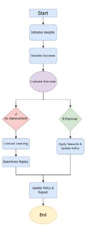

# GridAI Simulator

This directory contains the core Policy Gradient Reinforcement Learning model for GridAI, the advanced simulation system for designing the optimal future of Ireland's power grid from 2025 to 2050.

## Overview

The GridAI simulator is a custom-built AI model written in Rust that:

1. Simulates the Irish power grid's evolution from 2025 to 2050
2. Uses Policy Gradient Reinforcement Learning to optimize investment strategies
3. Balances multiple objectives: power reliability, CO₂ emissions, cost, and public opinion
4. Autonomously determines the optimal timeline for energy investments

## AI Model Structure

### Policy Gradient Reinforcement Learning

The core of the system is a Policy Gradient Reinforcement Learning model with these characteristics:

- **Clearly Defined Goals**: Optimize power reliability, emissions reduction, cost, and public opinion
- **Predefined Actions**: Building generators, implementing carbon offsets, upgrading efficiency, etc.
- **Reward System**: Actions that bring us closer to goals are rewarded, others penalized
- **Probabilistic Policy**: Adjusts probabilities over actions rather than estimating value functions

### Advanced AI Features

- **Weighting and Temporal Adaptation**: Year-dependent action weights that evolve over time
- **Contrast Learning**: When progress stalls, positive weighting for actions similar to successful runs
- **Experience Replay**: Re-runs successful simulations with targeted changes to isolate effective strategies
- **Multi-Objective Optimization**: Balances four key incentives rather than optimizing for a single metric

## Key Components

### Core Modules

- **`main.rs`**: Central orchestration of the simulation process
- **`action_weights.rs`**: Manages the probability distribution over possible actions
- **`generator.rs`**: Implements power generator types, capabilities, and constraints
- **`map_handler.rs`**: Manages the geographic representation of Ireland and spatial relationships
- **`carbon_offset.rs`**: Handles carbon offset objects
- **`power_storage.rs`**: Handles energy storage objects

### Support Modules

- **`constants.rs` & `const_funcs.rs`**: Economic, technological, and geographic parameters
- **`metal_location_search.rs`**: Apple Silicon-optimized spatial analysis for generator placement (unused in final implementation)
- **`logging.rs`**: Performance monitoring and timing instrumentation
- **`csv_export.rs`**: Data export functionality for results analysis and visualization
- **`simulation_config.rs`**: Configuration parameters for simulation behavior

## Simulation Process

The simulation follows a yearly cycle from 2025 to 2050:

1. **Calculate Current State**: Population, power requirements, emissions, etc.
2. **Select Actions**: Choose actions based on weighted probabilistic selection
3. **Apply Actions**: Implement selected generators, offsets, or other changes
4. **Handle Power Deficits**: Ensure 100% grid reliability through automatic correction
5. **Calculate Metrics**: Evaluate performance against multi-objective criteria
6. **Update Weights**: Adjust action probabilities based on performance
7. **Repeat**: Move to the next year until 2050 is reached

[]

## Performance Optimization

The simulator includes several performance optimizations:

- **Parallel Processing**: Multi-threaded simulation using Rayon
- **Checkpointing**: Robust save/resume capability for long-running simulations
- **Fast Simulation Mode**: Optimized simulation for rapid iteration during training (used before running full simulations for accuracy)
- **Smart Deficit Handling**: Automatic correction of power deficits to avoid wasted simulations

## Prerequisites

- Rust 1.70 or later
- I'm going to be so real with you, this could probably run on a potato, and still get 10,000 simulations per hour (my laptop got 100,000 per hour), so don't worry about prerequisites

## Installation and Setup

1. Ensure Rust is installed:
   ```bash
   curl --proto '=https' --tlsv1.2 -sSf https://sh.rustup.rs | sh
   ```

2. Clone the repository and navigate to the project directory:
   ```bash
   git clone https://github.com/ETM-Code/eirgrid.git
   cd eirgrid
   ```

3. Build the project:
   ```bash
   cargo build --release
   ```

## Usage

### Basic Simulation

```bash
# Run a simulation with default parameters (1000 iterations)
cargo run -- -n 1000

# Run with timing information enabled
cargo run -- -n 1000 --enable-timing

# Run with parallel processing (default)
cargo run -- -n 1000 --parallel
```

### Advanced Options

```bash
# Resume from checkpoint
cargo run -- --checkpoint-dir checkpoints

# Force full simulation (disables fast simulation mode)
cargo run -- --force-full-simulation

# Set custom checkpoint interval
cargo run -- --checkpoint-interval 10

# Use a specific random seed for deterministic simulation
cargo run -- --seed 12345

# Optimize for cost only, ignoring emissions and public opinion
cargo run -- --cost-only

# Enable revenue from energy sales to offset costs
cargo run -- --enable-energy-sales
```

## Output

The simulation produces several outputs:

- **Console Output**: Summary metrics and progress information
- **Log Files**: Detailed logging of simulation actions and metrics
- **Checkpoint Files**: Saved state for resuming simulations
- **CSV Exports**: Detailed data for analysis and visualization, including:
  - `simulation_summary.csv`: Overall simulation metrics
  - `yearly_settlements.csv`: Settlement data by year
  - `yearly_generators.csv`: Generator data by year
  - `yearly_carbon_offsets.csv`: Carbon offset data by year

## Extending the Model

To extend the model with new features:

1. **New Generator Types**: Add to the `GeneratorType` enum in `generator.rs`
2. **Custom Actions**: Extend the `GridAction` enum in `action_weights.rs`
3. **Additional Metrics**: Update the `SimulationMetrics` struct in `action_weights.rs`
4. **Improved Reward Function**: Modify the scoring logic in `score_metrics()` function

## Understanding the Code

- **Action Weights**: The core of the AI is in `action_weights.rs`, which manages the probability distribution over possible actions
- **Simulation Loop**: The main simulation logic is in the `run_simulation()` function in `main.rs`
- **Multi-threading**: Parallel simulation is managed in the `run_multi_simulation()` function
- **Constants**: Economic and technological parameters are defined in `constants.rs`

## Metal Acceleration

The simulator includes Metal-accelerated spatial analysis for Apple Silicon Macs:

- **`metal_location_search.metal`**: Metal shader code for parallel spatial calculations
- **`metal_location_search.rs`**: Rust interface to Metal GPU acceleration

## Related Components

The GridAI simulator works together with other components in the repository:

- **Map Data**: Geographic and infrastructure data from `mapData/` directory
- **Map Scraper**: Python scripts in `mapScraper/` for data preparation
- **Renderer**: Visualization system in `renderer/` for exploring results

## License

### GridAI Research and Academic License

This software is licensed under the following terms:

**Permitted Uses:**
- Individual use for personal experimentation and learning
- Academic and research use in non-commercial settings
- Educational use in classroom or course settings

**Requirements:**
- Attribution: Any use of this software must include proper citation and acknowledgment to the original authors: Eoghan Collins
- Notification: We appreciate being informed about research conducted using this software at [eoghancollins@gmail.com]

**Prohibited Uses:**
- Commercial use of any kind without explicit written permission
- Redistribution, in whole or in part, on any public repository or platform
- Modification and redistribution as a derivative work
- Use in production environments or for commercial policy decision-making
- Any use that does not include proper attribution

**No Warranty:** This software is provided "as is" without warranty of any kind, express or implied.

For permissions beyond the scope of this license, please contact [eoghancollins@gmail.com].