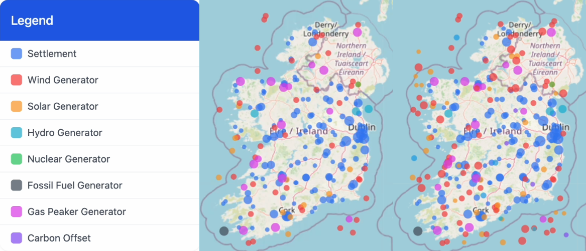

# GridAI Visualization System

This web-based visualization tool allows you to explore and analyze the results of the GridAI simulation for Ireland's power grid evolution from 2025 to 2050.



## Overview

The visualization system renders the simulation results generated by the GridAI Policy Gradient Reinforcement Learning model, showing how Ireland's power grid evolves over time under optimal investment strategies. It displays settlements, power generators, and carbon offsets on a map of Ireland, along with key metrics and trends through time.

## Key Features

- **Interactive Map**: 
  - Geospatial visualization of Ireland with accurate positioning
  - Dynamic display of settlements (blue), renewable generators (green), fossil fuel generators (orange), nuclear generators (purple), energy storage (light blue), and carbon offsets (green squares)
  - Size-based visualization indicates population, generation capacity, or offset amount

- **Timeline Controller**:
  - Navigate through years 2025-2050 using slider or playback controls
  - Animation capability for visualizing temporal changes
  - Year markers for significant events in the simulation

- **Metrics Panel**:
  - Real-time display of key simulation metrics:
    - Population growth
    - Power usage and generation
    - Public opinion scores
    - Annual and cumulative costs
    - CO₂ emissions, offsets, and net emissions

- **Trend Charts**:
  - Interactive visualizations showing:
    - Emissions profile over time
    - Power generation vs usage balance
    - Cost breakdowns by year and category
    - Public opinion trends

## Understanding the Visualization

### Map Elements

- **Settlement Markers**: Blue circles with size proportional to population
- **Generator Markers**: Color-coded by type:
  - Green: Renewable energy generators
  - Orange: Fossil fuel generators
  - Purple: Nuclear generators
  - Light Blue: Energy storage facilities
- **Carbon Offset Markers**: Green squares with size indicating offset amount

### Data Interpretation

- **Generator Placement**: Shows optimal geographical positioning based on:
  - Proximity to settlements (transmission costs)
  - Environmental considerations
  - Public opinion impact
  - Resource availability

- **Temporal Changes**: As the timeline advances, observe:
  - Early adoption of solar and wind
  - Gradual introduction of storage and offshore wind
  - Strategic implementation of carbon offsets
  - Transition to more advanced technologies like wave energy

- **Chart Trends**: The charts reveal:
  - Transition from positive to negative net emissions
  - Evolution of public opinion as grid transforms
  - Investment patterns aligning with technology maturity
  - Balance between generation capacity and growing demand

## Setup Instructions

### Local Development

1. Clone this repository
2. Navigate to the project directory
3. Open `index.html` in a web browser or serve with a local server:
   ```bash
   npx serve .
   ```

### Using with Simulation Data

The visualizer loads CSV data generated by the simulation. By default, it will look for data in:

- `data/simulation_summary.csv`: Summary metrics for the entire simulation
- `data/yearly_details/settlements.csv`: Detailed settlement data by year
- `data/yearly_details/generators.csv`: Detailed generator data by year
- `data/yearly_details/carbon_offsets.csv`: Detailed carbon offset data by year

If the CSV files are not found, sample data will be generated for demonstration purposes.

### Custom Data Import

You can also import custom CSV data through the user interface:

1. Click "Load CSV Data" in the controls panel
2. Select the appropriate simulation output files
3. The visualization will update with the loaded data

## Controls Guide

- **Timeline Controls**:
  - Play/Pause: Start or pause the year-by-year animation
  - Reset: Return to the starting year (2025)
  - Timeline Slider: Manually select a specific year
  - Speed Control: Adjust animation playback speed

- **Layer Controls**:
  - Toggle visibility of different element types
  - Adjust opacity of map layers
  - Switch between different base map styles

- **View Options**:
  - Focus on specific regions
  - Toggle between absolute and relative sizing
  - Enable/disable various metrics displays

## Implementation Details

The visualization is built using modern web technologies:

- **Leaflet**: Map rendering and geospatial visualization
- **D3.js**: Data visualization and SVG manipulation
- **Chart.js**: Interactive trend charts
- **PapaParse**: CSV parsing and data loading
- **noUiSlider**: Timeline control

## Relationship to Paper

This visualization system directly supports the findings outlined in the paper "Using Policy Gradient Reinforcement Learning to Design the Future of the Irish Power Grid" by:

1. Providing a visual representation of the AI's optimal investment strategy
2. Illustrating the temporal aspects of technology adoption
3. Demonstrating how Ireland achieves net-negative emissions by 2047
4. Showing the balance between power reliability, emissions, cost, and public opinion

## Extending the Visualization

To add new visualization features:

1. Modify the relevant JavaScript modules (map-setup.js, visualization.js, etc.)
2. Update the CSS styling in styles.css
3. Add new data processing functions in data-loader.js
4. For new chart types, extend the charts.js module

## Resources

- Paper: "Using Policy Gradient Reinforcement Learning to Design the Future of the Irish Power Grid"

## License

### GridAI Research and Academic License

This software is licensed under the following terms:

**Permitted Uses:**
- Individual use for personal experimentation and learning
- Academic and research use in non-commercial settings
- Educational use in classroom or course settings

**Requirements:**
- Attribution: Any use of this software must include proper citation and acknowledgment to the original authors: Eoghan Collins
- Notification: We appreciate being informed about research conducted using this software at [eoghancollins@gmail.com]

**Prohibited Uses:**
- Commercial use of any kind without explicit written permission
- Redistribution, in whole or in part, on any public repository or platform
- Modification and redistribution as a derivative work
- Use in production environments or for commercial policy decision-making
- Any use that does not include proper attribution

**No Warranty:** This software is provided "as is" without warranty of any kind, express or implied.

For permissions beyond the scope of this license, please contact [eoghancollins@gmail.com].